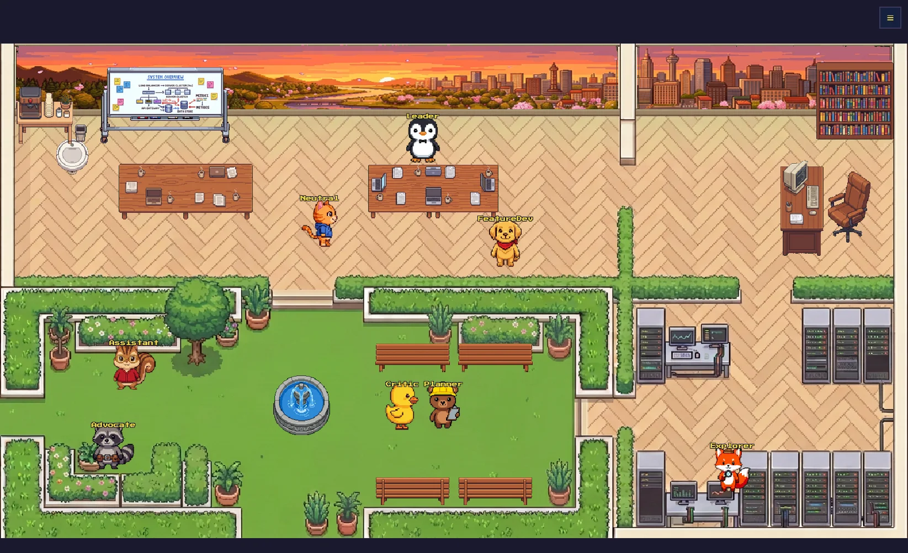

<p align="center">
  
</p>

<h1 align="center">Pie Office</h1>

<p align="center">
  A pixel-art virtual office that visualizes <a href="https://docs.anthropic.com/en/docs/claude-code">Claude Code</a> agent activity in real time.
</p>

<p align="center">
  <a href="#quick-start">Quick Start</a> &middot;
  <a href="#custom-characters">Custom Characters</a> &middot;
  <a href="#how-it-works">How It Works</a> &middot;
  <a href="#configuration">Configuration</a> &middot;
  <a href="LICENSE">MIT License</a>
</p>

---

## What It Does

Pie Office connects to [Claude Code](https://docs.anthropic.com/en/docs/claude-code) via [hooks](https://docs.anthropic.com/en/docs/claude-code/hooks) and displays agent activity as pixel-art characters moving through an RPG-style office. Each tool call triggers the corresponding character to walk to the appropriate room.

- Watch agents move between rooms as they read, write, search, and execute
- Speech bubbles show current activity in real time
- Side panel with agent list and live event log
- Multi-session support — see multiple Claude Code instances at once

## Features

- **Real-time SSE** — Server-Sent Events, no polling. Activity appears instantly.
- **9 characters** — Penguin, Cat, Dog, Squirrel, Duck, Raccoon, Fox, Bear, and a Robot Vacuum.
- **Custom characters** — Generate your own pixel-art sprites with AI ([Pokemon theme](CHARACTERS.md), etc.).
- **Smart routing** — Each tool type maps to the right character and room.
- **4-room office** — Balcony (idle), Cafeteria (coding), Manager Room (research), Server Room (debugging).
- **A\* pathfinding** — Characters navigate around furniture with smooth tile-based movement.
- **Instance alerts** — Server room computers show which sessions need attention (permission prompts, idle).
- **16 languages** — Auto-detects from browser locale.
- **Theme system** — Swap character sprites per theme (default animals, Pokemon, or your own).

## Quick Start

### 1. Clone & Install

```bash
git clone https://github.com/SojeongHa/PieOffice.git
cd pie-office

python3 -m venv venv
source venv/bin/activate
pip install -r backend/requirements.txt
```

### 2. Start the Server

```bash
./dev.sh 10317
```

Open [http://localhost:10317](http://localhost:10317) in your browser. You should see the pixel-art office with characters in their idle positions.

### 3. Connect Claude Code

**Option A: Using Claude Code (recommended)**

Open Claude Code in the pie-office directory and type:

```
/install-hooks
```

This safely merges the hooks into your existing settings without overwriting anything.

**Option B: Manual setup**

```bash
bash hook/install.sh
```

This prints a JSON snippet to manually add to `~/.claude/settings.json` (global) or `.claude/settings.json` (per-project). If you already have hooks configured, merge the entries carefully to avoid overwriting them.

After installing, restart Claude Code. Open a session and start working — the characters will move around the office in real time as agents read files, write code, and execute commands.

> **Tip:** Set `PIE_OFFICE_DEBUG=true` to see hook events in stderr for troubleshooting.

## Claude Code Skills

Open Claude Code in the pie-office directory to use these built-in skills:

| Skill | Command | What it does |
|-------|---------|-------------|
| **Install Hooks** | `/install-hooks` | Safely merge hooks into your settings (no overwrites) |
| **Distribute Characters** | `/distribute-character` | Auto-assign characters to your agents based on usage |
| **Add Character** | `/add-character` | Generate a custom pixel-art character with AI |

For the best experience, enable the **code-review** plugin in Claude Code settings — it provides `review-critic`, `review-advocate`, and `review-neutral` agent types that map to three office characters.

## Custom Characters

Generate any character as a pixel-art sprite and use it in your office.

### Using Claude Code (recommended)

```
Use the add-character skill to generate "pikachu:Pikachu, yellow electric
mouse Pokemon, red cheeks, pointed ears with black tips, lightning bolt tail"
and install it as leader.png in theme/pokemon/characters/
```

### Using the script directly

```bash
cd public/script
pip install google-genai pillow python-dotenv
echo "GEMINI_API_KEY=your_key" > .env

python3 generate_characters.py \
  --key "pikachu" \
  --description "Pikachu, yellow electric mouse Pokemon, red cheeks" \
  --output theme/pokemon/characters/
```

### Theme override

Create `config.local.json` in the project root:

```json
{
  "character_theme": "pokemon"
}
```

Only character sprites are overridden — the office layout stays the same.

See [CHARACTERS.md](CHARACTERS.md) for more examples (Charmander, Bulbasaur, Squirtle, etc.).

## How It Works

```
Claude Code Hooks ──> Flask Backend ──> SSE Broadcast ──> Phaser 3 Frontend
  (PreToolUse,         (in-memory       (agent_join,       (pixel-art
   PostToolUse,         state,           agent_update,      sprites,
   SubagentStart,       stale sweep,     agent_leave,       A* pathfinding,
   SubagentStop,        leave timers)    agent_chat)        speech bubbles)
   Notification)
```

### Agent routing

| Tool | Character | Room |
|------|-----------|------|
| Read, Grep, Glob, Bash | Explorer (Fox) | Manager / Server |
| Write, Edit | Assistant (Squirrel) | Cafeteria |
| Agent, TaskCreate | Planner (Bear) | Cafeteria |
| Skill, MCP, AskUser | Leader (Penguin) | Varies |
| WebSearch, WebFetch | Explorer (Fox) | Manager |

### Lifecycle

1. **Join** — Agent appears with a walk-in animation
2. **Active** — Moves between rooms based on tool use, speech bubbles show activity
3. **Idle** — Returns to home position, wanders randomly
4. **Leave** — 5s delayed departure

Non-resident agents (temporary subagents) are auto-removed after 60 seconds of idle.

## Configuration

### `theme/default/config.json`

- `agent_map` — Maps agent IDs to sprites, display names, home positions
- `rooms` — Room definitions with spawn points
- `objects` — Furniture and decoration placement
- `robot_vacuum` — Autonomous robot vacuum settings

### Environment variables

| Variable | Default | Description |
|----------|---------|-------------|
| `THEME` | `default` | Active theme directory |
| `PORT` | `10317` | Server port |
| `PIE_OFFICE_DEBUG` | `false` | Enable hook debug logging |

### Language

Append `?lang=ko` to the URL, or let it auto-detect from your browser.

## Project Structure

```
pie-office/
  backend/             # Flask server (app.py, state.py, sse.py)
  frontend/            # Phaser 3 game + UI modules
    js/                # config, game, agents, sse, ui, pathfinding
    i18n/              # 16 language files
  hook/                # Claude Code hook integration
  public/script/       # Character sprite generator (open source)
  theme/default/       # Tilemap, tileset, characters, objects, backgrounds
  tools/               # Collision editor
```

## Requirements

- Python 3.10+
- Flask 3.0+
- [Phaser 3.85.0](https://phaser.io/) (loaded from CDN, no install needed)
- A modern browser (Chrome, Firefox, Safari, Edge)
- [Claude Code](https://docs.anthropic.com/en/docs/claude-code) (for live agent events)
- Gemini API key (only needed for [character generation](CHARACTERS.md))

## Contributing

Contributions are welcome! Here's how you can help:

- **Bug reports & feature requests** — [Open an issue](../../issues). Screenshots and reproduction steps are appreciated.
- **Pull requests** — For anything beyond a small fix, please open an issue first to discuss the approach.
- **New characters & themes** — Created a cool character or theme? Share it via PR or issue.
- **Translations** — Improve or add translations in `frontend/i18n/`.

## License

MIT — see [LICENSE](LICENSE).
